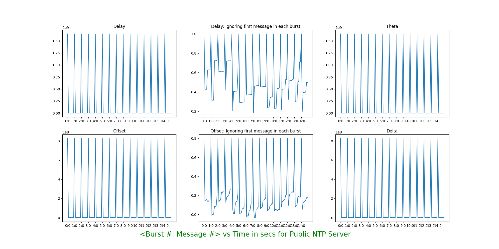
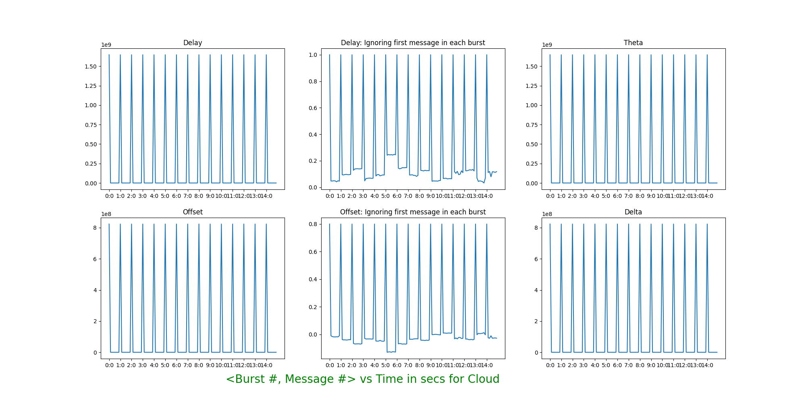
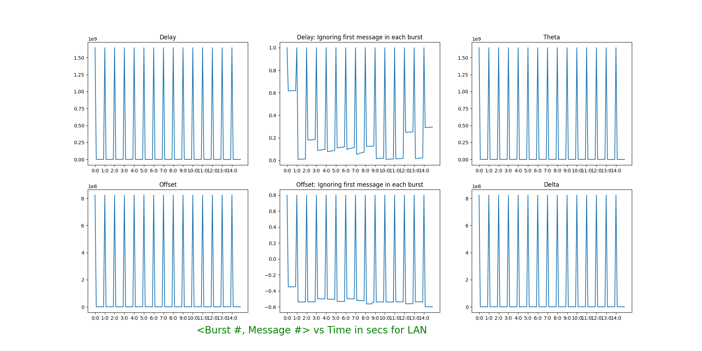

## NTP implementation and experiments

Team: Sai Akhil, Tushar Gautam

# Experiment
 
 ### Setup
 To bring up NTP server:
 ```bash
  node experiment/server.js
 ```

To bring up NTP client
```bash
  node experiment/client.js
```
The host and port for NTP server and client can be provided in `server.js` and `client.js` respectively.
The codebase requires `nodejs` to be installed and UDP ports to be opened in firewall settings.

### NTP servers
We ran experiment with 3 scenarios with NTP client on local machine i.e our laptop for all the scnearios:
1. NTP server on Google Cloud GCP
2. NTP server on public NTP server. We've avoided using CU Boulder NTP server because of resource quota. Instead we used, `a.st1.ntp.br`
3. NTP server on LAN with NTP server running on another laptop under the same WiFi network.

For each of the scenario, we've sent 8 packets in a burst with total 15 bursts at an interval of 4 minutes. First packet of each burst has rx and tx timestamps
set as NTP epoch time (referenced as 0) which is visible as an outlier in the graphs. Each of the scenario results are plotted in the graphs under Result section. 

# Results
###  Graphs for Public NTP servers. 
The plots in the middle are plotted on a log-scale for y axis to compensate for large delay and offset due to the first message in a burst. For asthetic reasons,
we've sampled xticks to display label for only one packet in each burst. However, this doesn't affect the total datasets plotted.



### Graphs for NTP server in Google Cloud


### Graph for NTP server in LAN



The T1, T2, T3, T4 values are present under `Results/**/{T1,T2,T3,T4}.csv` for each scenario mentioned above.

# Analysis
As observed in the 3 scenarios, the Public NTP servers have more jitter as the delay and offsets are varying. Measurements for NTP on Google Cloud on the other hand is better than public NTP but not better than LAN. LAN as expected has much less jitter than other scenarios. This can be seen in relatively flat graph for LAN. The spikes we see in the graphs are due to the delay and offset outliers recorded for the first message of each burst. If we ignore the outlier, the general
graph fluctuations are in line with the network latencies and jitter expected for Public NTP, Cloud NTP and LAN NTP.

With smaller delay we have lower error in estimation because true offset differs from computed offset by +- delay/2. Also, with more symmetric delay, we have difference of true offset from estimated offset becoming close to zero. `True offset = Observed offset + (t’ - t)/2`. So with more symmetric RTT (`t=t'`), we have observed offset close to true offset. Furthermore as offset is about half of the delay as can be seen in the graph, we can predict that the round trip time is close to symmetric and hence our estimate is accurate to the current time.

